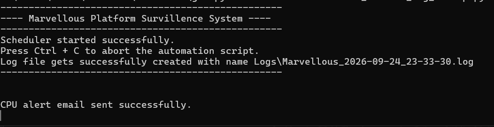
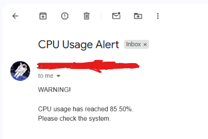

# Platform Surveillance System

A Python-based system monitoring and automation tool that periodically collects system information, generates detailed log files, and sends an email alert when CPU utilization reaches a defined threshold.

## Demo

### System Monitoring



### CPU Alert Email



## Features

- Monitors CPU utilization
- Monitors RAM utilization
- Reports total, used, and available RAM
- Monitors disk usage
- Monitors network data transfer
- Scans currently running processes
- Records CPU and RAM usage of processes
- Generates timestamped system reports
- Automatically executes monitoring at a configurable interval
- Sends email alerts when CPU utilization reaches a defined threshold
- Uses environment variables to protect email credentials
- Handles processes that terminate during scanning
- Supports command-line configuration

## Demo

### System Monitoring


### CPU Alert Email


## Technologies Used

- Python
- psutil
- schedule
- smtplib
- email
- os
- sys
- time

## Project Structure

```text
Platform-Surveillance-System/
│
├── PlatformSurveillance_Process_Log.py
├── requirements.txt
├── .gitignore
├── README.md
├── LICENSE
└── screenshots/
    ├── monitoring.png
    └── cpu-alert.png
```

## Installation

### 1. Clone the repository

```bash
git clone https://github.com/bemo-codes/Platform-Surveillance-System.git
cd Platform-Surveillance-System
```

### 2. Create a virtual environment

```bash
python -m venv venv
```

Activate it on Windows:

```bash
venv\Scripts\activate
```

### 3. Install dependencies

```bash
pip install -r requirements.txt
```

## Email Configuration

The system uses environment variables to keep email credentials outside the source code.

Set the sender email:

```cmd
set EMAIL_SENDER=your_email@gmail.com
```

Set the Gmail App Password:

```cmd
set EMAIL_APP_PASSWORD=your_app_password
```

> Do not use your normal Gmail password. Use a Google App Password.

The recipient email is provided when running the program.

## Usage

### Display help

```bash
python PlatformSurveillance_Process_Log.py -h
```

### Display usage information

```bash
python PlatformSurveillance_Process_Log.py -u
```

### Run the monitoring system

```bash
python PlatformSurveillance_Process_Log.py 1 Logs "receiver@example.com"
```

Where:

- `1` = monitoring interval in minutes
- `Logs` = directory where log files will be stored
- `receiver@example.com` = email address that receives CPU alerts

Example:

```bash
python PlatformSurveillance_Process_Log.py 1 Logs "example@gmail.com"
```

## Generated Log Reports

The system generates timestamped log files containing:

- CPU utilization
- Number of CPU cores
- RAM usage
- Total RAM
- Network data sent
- Network data received
- Disk usage
- Running processes
- Process CPU utilization
- Process RAM utilization
- Process username and status

Example:

```text
Logs/
└── Marvellous_2026-09-24_22-15-19.log
```

## CPU Alert System

When CPU utilization reaches or exceeds the configured threshold, the system sends an email alert.

The alert contains:

- CPU utilization percentage
- Warning message
- Notification to check the system

The system also prevents repeated alerts while CPU utilization remains above the threshold.

## Security

Sensitive credentials are **not stored directly in the source code**.

Environment variables are used for:

```text
EMAIL_SENDER
EMAIL_APP_PASSWORD
```

The `.gitignore` file prevents environment files, generated logs, Python cache files, and virtual environments from being committed.

Never commit your Gmail App Password to GitHub.

## Error Handling

The process scanner handles processes that disappear while the scan is running.

For example, a process may terminate between the time it is detected and the time its information is requested. These cases are handled using `psutil.NoSuchProcess` and `psutil.AccessDenied`.

This prevents the entire monitoring system from crashing because of a single process.

## Requirements

- Python 3.x
- Windows / compatible operating system
- Internet connection for email alerts
- Gmail account with App Password enabled

## Future Improvements

Possible future improvements include:

- GUI dashboard
- Real-time monitoring graphs
- Configurable CPU and RAM thresholds
- Multiple alert thresholds
- Email log attachments
- SMS or notification support
- Database storage for historical metrics
- Web-based monitoring dashboard
- Automated system health reports
- Support for multiple recipient email addresses

## Author

**Shivam Ramesh Kurlekar**

GitHub:  
https://github.com/bemo-codes

## License

This project is licensed under the MIT License. See the `LICENSE` file for details.